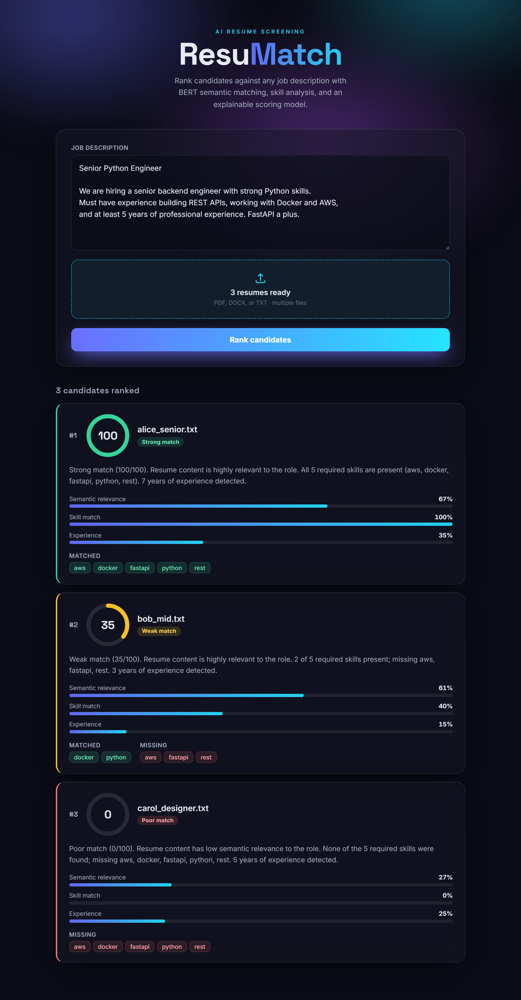
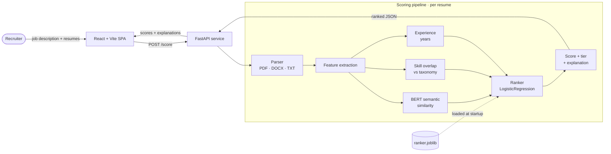
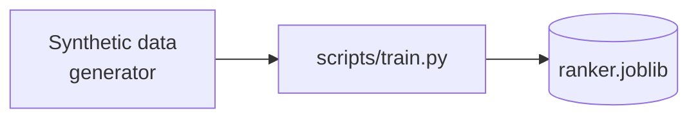

<div align="center">

# ResuMatch

### AI-powered resume screening that ranks candidates against any job description

Paste a job description, drop in a batch of resumes, and get an explainable,
ranked shortlist in seconds — powered by BERT semantic matching, skill
analysis, and a calibrated scoring model.




</div>

---

## Table of contents

- [Why ResuMatch](#why-resumatch)
- [Features](#features)
- [How scoring works](#how-scoring-works)
- [Architecture](#architecture)
- [Tech stack](#tech-stack)
- [Getting started](#getting-started)
- [API](#api)
- [Deployment](#deployment)
- [Project structure](#project-structure)
- [Testing](#testing)
- [Roadmap](#roadmap)
- [License](#license)

## Why ResuMatch

Screening a stack of resumes by hand is slow and inconsistent. Keyword filters
are brittle — they miss strong candidates who phrase things differently and
reward keyword stuffing. ResuMatch reads each resume *semantically*, checks it
against the concrete skills a role needs, factors in experience, and produces a
**0–100 match score with a plain-English explanation** for every candidate, so
a recruiter can trust — and defend — the ranking.

## Features

- **Semantic matching** — sentence-transformer (BERT) embeddings compare the
  *meaning* of a resume to the job description, not just keywords.
- **Skill gap analysis** — detects required skills from the JD against a curated
  taxonomy and reports exactly which are **matched** and **missing** per candidate.
- **Experience signal** — extracts and normalizes years of experience.
- **Calibrated scoring** — a scikit-learn model fuses the signals into a single
  0–100 score and a tier (Strong / Moderate / Weak / Poor).
- **Explainable by design** — every score ships with a written rationale and a
  per-signal breakdown, so nothing is a black box.
- **Batch upload** — score many resumes at once (PDF, DOCX, TXT); unreadable
  files are skipped with a warning instead of failing the whole run.
- **Immersive UI** — a fast, modern single-page app with animated score gauges
  and signal bars.
- **Container-ready** — Dockerfiles and a Compose file for one-command spin-up.

## How scoring works

Each resume is parsed to text, then reduced to three normalized signals:

| Signal | How it's computed | Range |
|--------|-------------------|-------|
| **Semantic relevance** | Cosine similarity between BERT embeddings (`all-MiniLM-L6-v2`) of the job description and the resume | 0–1 |
| **Skill match** | Share of JD-required skills found in the resume (curated taxonomy + fuzzy matching) | 0–1 |
| **Experience** | Years of experience extracted from the resume, normalized (capped at 20) | 0–1 |

A scikit-learn `LogisticRegression` model combines these into a fit probability,
scaled to a **0–100 score**. The model is trained offline and serialized to
`ranker.joblib`, which the API loads once at startup — so scoring a candidate is
a single fast `predict` call.

> **A note on the model.** The shipped ranker is trained on *synthetic,
> heuristic-labeled* data: feature vectors are sampled and labeled by a
> transparent weighting (`0.5·relevance + 0.35·skill_match + 0.15·experience`).
> This makes the project fully reproducible out of the box, but the model learns
> that heuristic rather than real hiring outcomes. To productionize, replace the
> data generation in `backend/scripts/train.py` with real labeled examples and
> retrain — the rest of the pipeline is unchanged.

## Architecture

The backend owns the entire ML pipeline; the frontend is a thin client that
calls a single `POST /score` endpoint.



The ranker is produced **offline** and baked into the image, so requests never
wait on training:



## Tech stack

- **Backend:** Python, FastAPI, sentence-transformers, scikit-learn, pypdf,
  python-docx, rapidfuzz
- **Frontend:** React, Vite, TypeScript (plain CSS, no UI framework)
- **Testing:** pytest (backend), Vitest + Testing Library (frontend)
- **Ops:** Docker, docker-compose, nginx (static frontend)

## Getting started

### Prerequisites
- Python 3.11+
- Node.js 18+

### 1. Backend

```bash
cd backend
python -m venv .venv
# Windows:
.venv\Scripts\activate
# macOS / Linux:
# source .venv/bin/activate

pip install -r requirements.txt
python -m scripts.train          # trains the model -> ranker.joblib
uvicorn resumatch.api:app --port 8000
```

The API is now live at `http://localhost:8000` (`/health` to check).

### 2. Frontend

```bash
cd frontend
npm install
npm run dev
```

Open the printed Vite URL (default `http://localhost:5173`), paste a job
description, upload resumes, and click **Rank candidates**.

## API

### `POST /score`
Multipart form: `jd_text` (string) + one or more `resumes` files.

```bash
curl -X POST http://localhost:8000/score \
  -F "jd_text=Senior Python engineer with Docker, AWS and 5 years experience." \
  -F "resumes=@alice.pdf" -F "resumes=@bob.docx"
```

```jsonc
{
  "candidates": [
    {
      "filename": "alice.pdf",
      "score": 100.0,
      "tier": "Strong match",
      "explanation": "Strong match (100/100). Resume content is highly relevant to the role. All 3 required skills are present (aws, docker, python). 6 years of experience detected.",
      "matched_skills": ["aws", "docker", "python"],
      "missing_skills": [],
      "experience_years": 6.0,
      "semantic_similarity": 0.879,
      "skill_overlap": 1.0
    }
  ],
  "warnings": []
}
```

Candidates are returned sorted by score (descending). Unreadable files appear in
`warnings` instead of failing the request.

### `GET /health`
Returns `{ "status": "ok", "ranker_loaded": true }`.

## Deployment

ResuMatch ships as two deployable units: a **backend container** (FastAPI + the
ML pipeline) and a **static frontend** (Vite build served by any static host or
the bundled nginx image). Both Dockerfiles and a Compose file are included.

### Option A — Docker Compose (one command)

The fastest way to run the whole stack in production-like containers:

```bash
docker compose up --build
```

- Frontend → http://localhost:5173
- Backend  → http://localhost:8000

The backend image **trains the ranker and pre-caches the embedding model at
build time**, so the first request is fast and the container needs no network
at runtime.

> The frontend reads the API URL from the `VITE_API_BASE` build argument
> (baked at build time, since Vite is a static bundle). For non-local
> deployments, set it to your public backend URL in `docker-compose.yml` or as a
> `--build-arg`.

### Option B — Deploy the pieces separately

**Backend (container).** Build and run anywhere that runs a container
(Render, Railway, Fly.io, AWS ECS, Google Cloud Run, Azure Container Apps):

```bash
cd backend
docker build -t resumatch-api .
docker run -p 8000:8000 resumatch-api
```

Most platforms inject a `$PORT` — bind to it:

```bash
uvicorn resumatch.api:app --host 0.0.0.0 --port ${PORT:-8000}
```

For higher throughput, run multiple workers (note: each worker loads its own
copy of the model, so size memory accordingly):

```bash
uvicorn resumatch.api:app --host 0.0.0.0 --port 8000 --workers 2
```

**Frontend (static).** Produce an optimized build and deploy the `dist/`
folder to Vercel, Netlify, Cloudflare Pages, GitHub Pages, or any static host:

```bash
cd frontend
VITE_API_BASE="https://your-api-host.com" npm run build
# upload ./dist  (Vercel/Netlify: set build = "npm run build", output = "dist")
```

Or serve it with the bundled nginx image:

```bash
docker build --build-arg VITE_API_BASE="https://your-api-host.com" -t resumatch-web ./frontend
docker run -p 8080:80 resumatch-web
```

### Production checklist

- **CORS** — the API allows `localhost:5173` by default. Add your deployed
  frontend origin to `allow_origins` in `backend/resumatch/api.py` (or wire it
  to an environment variable) before going live.
- **HTTPS** — terminate TLS at your platform's load balancer / reverse proxy.
- **Model artifact** — the image bakes `ranker.joblib`; to retrain with your own
  data, update `scripts/train.py` and rebuild.
- **Health checks** — point your platform's probe at `GET /health`.
- **Resources** — the embedding model needs roughly 300–500 MB RAM per worker.

## Project structure

```
backend/
  resumatch/
    parser.py        # PDF / DOCX / TXT -> text
    skill_matcher.py # skill detection (taxonomy + fuzzy)
    features.py      # BERT similarity, skill overlap, experience
    ranker.py        # scikit-learn model wrapper
    explain.py       # tier + plain-English rationale
    api.py           # FastAPI app
    skills.json      # curated skill taxonomy
  scripts/train.py   # trains + serializes the ranker
  tests/             # pytest suite
  Dockerfile
frontend/
  src/
    api.ts                  # typed client
    components/             # ScoreGauge, CandidateCard, ResultsTable
    App.tsx                 # page shell
  Dockerfile
  nginx.conf
docker-compose.yml
```

## Testing

```bash
# backend
cd backend && pytest

# frontend
cd frontend && npm run test -- --run
```

## Roadmap

- Train on real labeled hiring data
- Recruiter feedback loop with online retraining
- OCR support for scanned resumes
- Configurable skill taxonomies per role / industry
- Export shortlists to CSV / ATS integrations

## License

Released under the MIT License. See [LICENSE](LICENSE).
